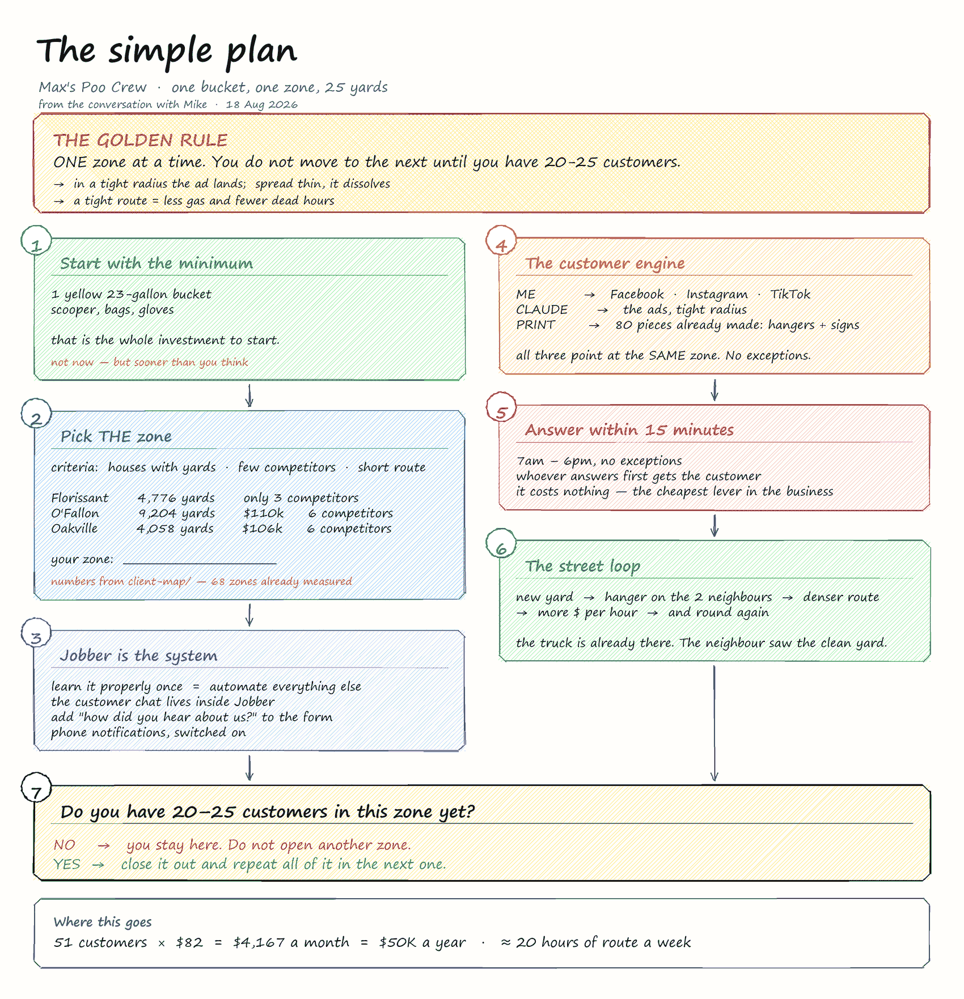

# The simple plan

The conversation with Mike on 18 August 2026, on one sheet.

It does not replace [`plan/`](../plan/) — that one has the full funnel map, eleven
steps and where the plan leaks today. This is the version that fits in your head:
**one bucket, one zone, 25 yards.**

## Editing it

`plan.excalidraw` is the editable file. Open <https://excalidraw.com> → menu →
*Open* → pick the file. Everything on it is ordinary boxes and text, so it can be
moved, crossed out and written over. Save it back over the file here.

`plan.png` is what GitHub shows above. If you change the `.excalidraw`, export a new
PNG from Excalidraw (*Export image* → PNG) so the two do not drift apart.

---

## The golden rule

**ONE zone at a time. You do not move to the next until you have 20-25 customers.**

Two reasons, and both cost money when they are ignored:

- **In a tight radius the ad lands.** The same budget split across six towns does
  not reach anyone twice. Concentrated on one, people start recognising the name —
  which is the point where an ad stops costing and starts paying.
- **A tight route means less gas and fewer dead hours.** Twenty yards inside one
  zone is half a morning. Twenty yards scattered across the county is the whole day,
  and the difference goes into the tank.

## The seven steps

### 1 · Start with the minimum

A yellow 23-gallon bucket, a scooper, bags and gloves. That is the whole investment
to start — not now, but sooner than you think.

### 2 · Pick THE zone

Criteria: houses with yards · few competitors · short route.

The numbers come from [`client-map/`](../client-map/), which already has 68 zones
measured:

| Zone | Yards | Median income | Competitors |
|---|---:|---:|---:|
| Florissant | 4,776 | $65k | **3** |
| O'Fallon | 9,204 | $110k | 6 |
| Oakville | 4,058 | $106k | 6 |

Florissant has the least competition and the largest base in the north; O'Fallon
pays close to double per customer but already has six operators working it. That is
a real trade, not a tie — worth deciding on purpose rather than by drift.

**Your zone: ______________________**

### 3 · Jobber is the system

Learning it properly once is what makes automating everything else possible.

- The customer chat lives inside Jobber, not on a personal phone.
- Add "how did you hear about us?" to the form, with the same options as the QR
  tags. Without it you can see which piece drove a visit but never which piece drove
  a customer.
- Phone notifications, switched on.

### 4 · The customer engine

| Who | What |
|---|---|
| Me | Facebook · Instagram · TikTok |
| Claude | the ads, tight radius |
| Print | the 80 pieces already made: door hangers + signs |

All three point at the **same** zone. No exceptions — that is the golden rule again.

### 5 · Answer within 15 minutes

7am to 6pm. Whoever answers first gets the customer, and by the time you answer late
the money to generate that lead has already been spent. It costs nothing, which
makes it the cheapest lever in the business.

### 6 · The street loop

New yard → hanger on the two neighbours → denser route → more dollars per hour →
and round again.

The truck is already there and the neighbour already saw the clean yard. That is why
a clustered route is worth more than a scattered one at the same customer count.

### 7 · Do you have 20-25 in this zone yet?

- **No** → you stay here. Do not open another zone.
- **Yes** → close it out and repeat all of it in the next one.

---

## Where this goes

51 customers × $82 = **$4,167 a month** = **$50K a year**, on about 20 hours of route
a week.
